# MSE Technical Architecture

Management Strategy Evaluation (MSE) — also referred to as the *Closed Loop Simulator* in EwE5 — is a stochastic Monte-Carlo framework that wraps the Ecosim simulation engine. It repeatedly runs Ecosim through a set of *trials*, each time perturbing catchability and biomass estimates with configurable noise, applies a regulatory model (quota/effort controls), and collects statistics across all trials.

---

## High-level component overview

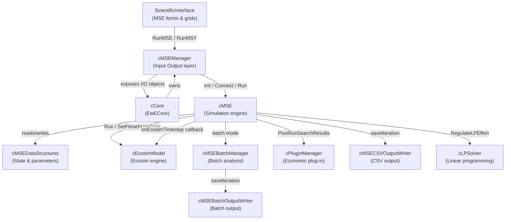

---

## Package / namespace map

| Namespace / folder | Key classes | Responsibility |
|---|---|---|
| `EwECore.MSE` (Model) | `cMSE` | Core closed-loop simulation loop, assessment, regulations |
| `EwECore.MSE` (Model) | `cMSEDataStructures` | All run-time state arrays (biomass, effort, quota, statistics) |
| `EwECore.MSE` (Model) | `cMSECSVOutputWriter` | Writes per-iteration CSV files to the autosave folder |
| `EwECore.MSE` (Input Output) | `cMSEManager` | Orchestrates threading, exposes I/O objects to the UI layer |
| `EwECore.MSE` (Input Output) | `cMSEParameters` | Scalar run parameters (assessment method, n-trials, effort mode …) |
| `EwECore.MSE` (Input Output) | `cMSEGroupInput` | Per-group inputs (biomass CV, reference levels, HCR parameters) |
| `EwECore.MSE` (Input Output) | `cMSEFleetInput` | Per-fleet inputs (effort CV, quota type, LP bounds, quota shares) |
| `EwECore.MSE` (Input Output) | `cMSEOutput` | Exposes statistics back to the UI |
| `EwECore.MSEBatchManager` | `cMSEBatchManager` | **Not used anymore.** Runs a sequence of MSE configurations from a command file |
| `EwECore.MSEBatchManager` | `cMSEBatchDataStructures` | Batch-specific state (TFM groups, TAC groups, FixedF groups) |
| `EwECore.MSEBatchManager` | `cMSEBatchOutputWriter` | Output writer used in batch mode |
| `EwECore.MSECommandFile` | `cMSECommandFileReader` | Parses the batch command file |

---

## Regulation modes and effort sources

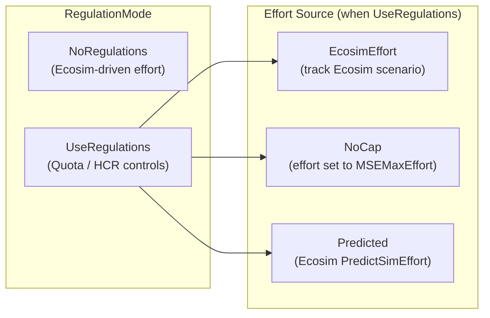

When `UseRegulations` is active, a per-fleet `QuotaType` determines how effort is constrained each year:

| `eQuotaTypes` value | Behaviour |
|---|---|
| `NoControls` | Fleet is unregulated |
| `Weakest` | Effort capped to protect the most vulnerable stock |
| `HighestValue` | Effort maximises highest-value stock |
| `Selective` | Per-group selectivity quota |
| `Effort` | Direct effort cap (not yet fully implemented) |

---

## Run lifecycle

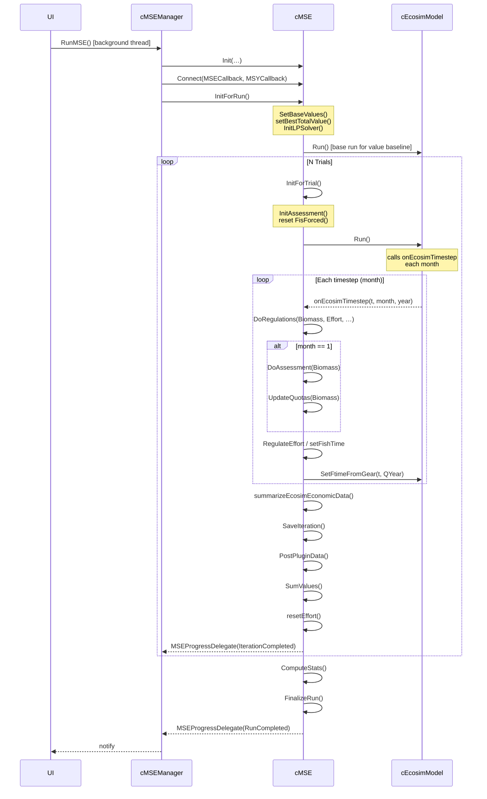

---

## Per-timestep regulation decision tree

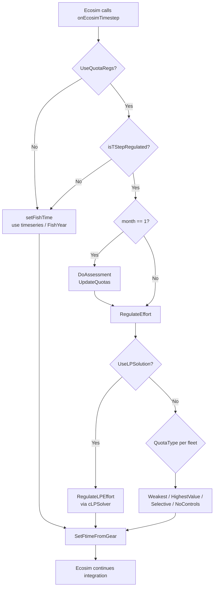

---

## Stock assessment methods

Three methods are available (`eAssessmentMethods`), selected per run:

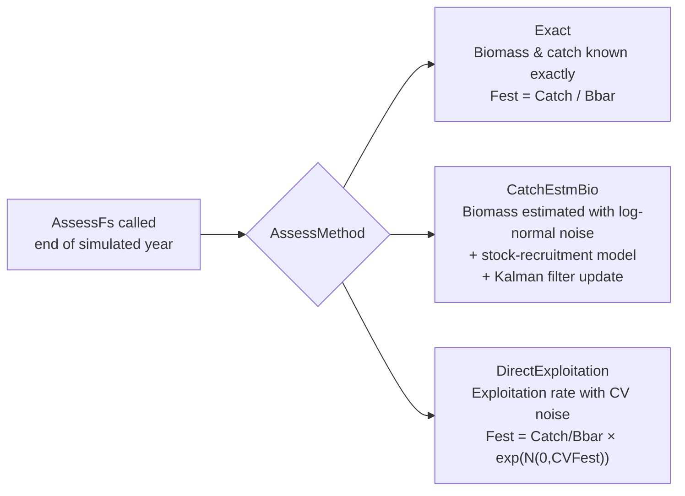

The `CatchEstmBio` method uses a Beverton–Holt stock-recruitment model and a Kalman filter (`KalmanGain`, `GstockPred`, `RStock0`) to propagate the biomass estimate through time.

---

## Statistics collection

After all trials, `cMSEDataStructures` holds several `cMSESummaryStats` instances that accumulate values across trials and years:

| Statistics object | Dimension | Content |
|---|---|---|
| `BioStats` | groups × years | Biomass |
| `CatchGroupStats` | groups × years | Catch by group |
| `CatchFleetStats` | fleets × years | Catch by fleet |
| `EffortStats` | fleets × years | Fishing effort |
| `BioEstStats` | groups × years | Estimated biomass |
| `FLPDualValue` | fleets × years | LP dual (shadow) values |
| `ValueFleetStats` | fleets × years | Economic value per fleet |
| `ProfitSum` / `CostSum` / `JobsSum` | fleets | Economic summary |

`ComputeStats()` is called once after all trials to derive mean, standard deviation, CV, histograms, and percentage above/below reference levels.

---

## Batch analysis

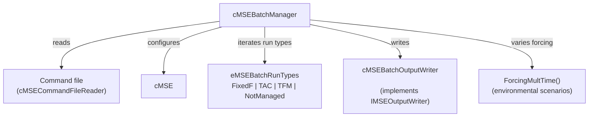

The batch manager reads a command file that defines sets of FixedF, TAC, and TFM fishing scenarios. For each configuration it seeds `cMSEDataStructures`, calls `cMSE.Run()`, and routes output through `cMSEBatchOutputWriter` instead of the default CSV writer.

---

## Output writers

The `IMSEOutputWriter` interface decouples the simulation from persistence:

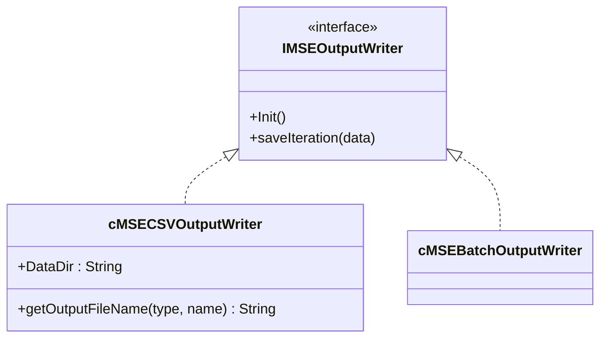

The active writer is selected by `OutputWriterFactory()` in `cMSE`: batch runs use `cMSEBatchOutputWriter`; interactive runs use `cMSECSVOutputWriter` which writes one CSV file per group/fleet to the configured autosave folder.

Output file prefixes (constants on `cMSE`):

| Constant | File prefix |
|---|---|
| `BIOMASS_DATA` | `MSE_Biomass` |
| `CATCH_DATA` | `MSE_CatchByGroup` |
| `EFFORT_DATA` | `MSE_Effort` |
| `FLEETCATCH_DATA` | `MSE_CatchByFleet` |
| `QUOTAGROUP_DATA` | `MSE_QuotaByGroup` |

---

## Randomness and reproducibility

- In **interactive** mode, the random seed is derived from `Date.Now.Ticks`, giving a different stochastic sequence every run.
- In **batch** mode, the seed is fixed to `42`, ensuring reproducible results across batch iterations.
- A single `System.Random` instance (`m_rndGen`) is created at the start of each run and used throughout for biomass noise (`CVbiomEst`), effort noise (`VarQest`), recruitment noise (`cvRec`), and catchability growth noise (`VarQgrow`).

---

## Key data flows

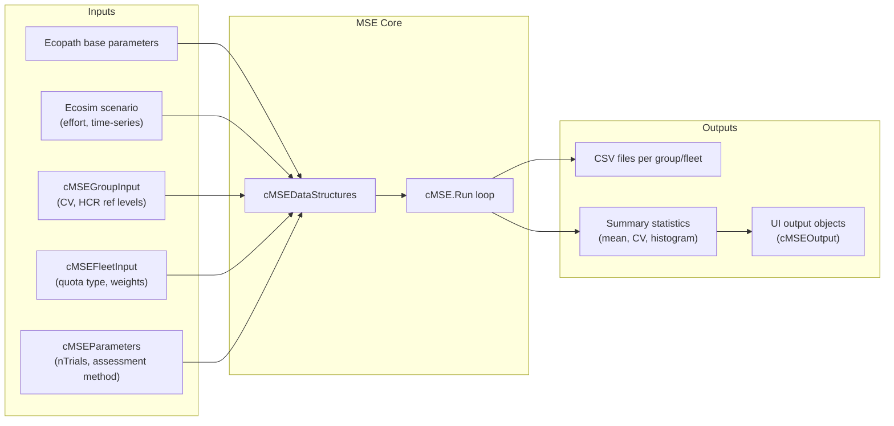

---

## Linear programming with lpsolve55.dll

When `UseLPSolution = True` (the default when `UseRegulations` is active), the MSE replaces the simple rule-based effort cap with a full linear program that maximises the total landed value across all fleets subject to per-group fishing-mortality ceilings.

### Native library integration

`lpsolve55.dll` is an unmanaged C library (lp_solve 5.5). EwECore ships two copies of it side-by-side with the managed assembly:

```
Sources/EwECore/Includes/LPSolve/win32/lpsolve55.dll   (32-bit)
Sources/EwECore/Includes/LPSolve/win64/lpsolve55.dll   (64-bit)
```

The inner class `cLPSolver.lpsolve55` declares every P/Invoke entry point with `Declare Function - Lib "lpsolve55.dll"`. At startup, `lpsolve55.Init()` calls `SetDllDirectoryA` (kernel32) to point the loader at the correct architecture subfolder, then verifies the DLL exists before setting an `IsUsable` flag. The solver is therefore **Windows-only**; `IsSupported()` returns `False` on any other platform.

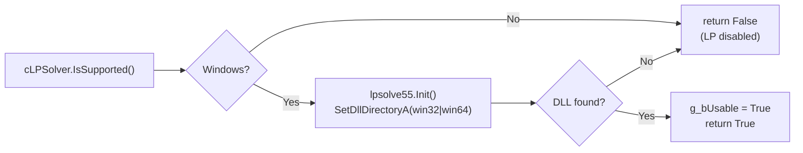

### Class structure

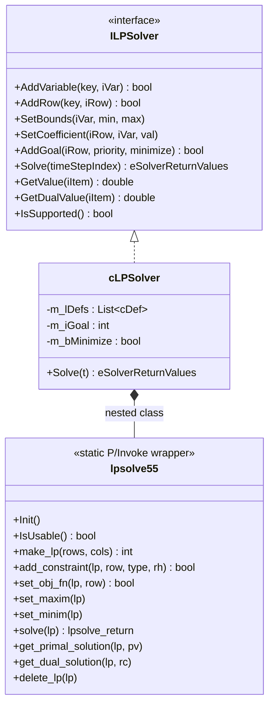

`cLPSolver` builds an in-memory model (variables and constraint rows stored as `cVarDef` / `cRowDef` objects), then on each call to `Solve()`:
1. Creates a fresh unmanaged LP model via `make_lp`.
2. Sets variable bounds and row coefficients.
3. Runs the solver.
4. Extracts primal and dual solutions.
5. Destroys the unmanaged model with `delete_lp`.

The unmanaged model is **recreated from scratch every timestep** rather than being warm-started.

### How MSE uses the LP solver

`InitLPSolver()` is called once during `InitForRun()` and builds the persistent `cLPSolver` instance:

| LP element | Maps to | Bound |
|---|---|---|
| **Variable** per fleet | `FishRateGear(fleet, t)` - the decision variable | `[LowLPEffort(fleet), UpperLPEffort(fleet)]` |
| **Constraint row** per living group | Total fishing mortality on that group | `[0, FTarget(group)]` |
| **Goal row** ("VALUE") | Maximise total landed value | Unbounded above |

`RegulateLPEffort()` is called at the **first month of each regulated year** and repopulates the LP with current-year data before solving:

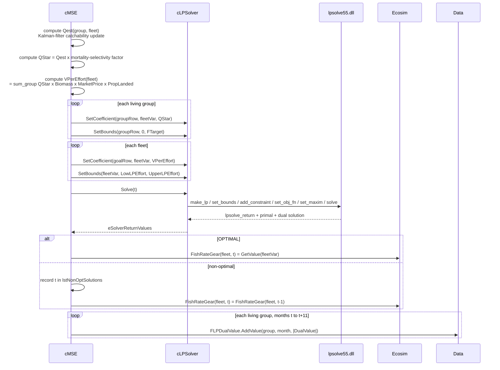

### The LP problem formulation

```
Maximise:   sum_f  VPerEffort(f) * E(f)

Subject to:
  For each living group g:
    sum_f  QStar(g, f) * E(f)  <=  FTarget(g)       [F-cap per group]

  For each fleet f:
    LowLPEffort(f) <= E(f) <= UpperLPEffort(f)        [effort bounds]
```

| Symbol | Description |
|---|---|
| `E(f)` | Effort for fleet `f` - the decision variable |
| `VPerEffort(f)` | Value density: `sum_g QStar(g,f) * B(g) * Market(f,g) * PropLanded(f,g)` |
| `QStar(g,f)` | Effective catchability: `Qest(g,f) * (PropLanded + (1-PropLanded) * PropDiscardMort)` |
| `FTarget(g)` | Target fishing-mortality ceiling for group `g` (from `cMSEDataStructures`) |
| `Qest(g,f)` | Kalman-filtered catchability estimate, updated each year |

### Dual values (shadow prices)

After each solve, `GetDualValue()` is called for every group row. The absolute value of the dual is stored in `FLPDualValue` for all 12 months of the regulated year and exposed in the statistics output. These shadow prices indicate how much the objective (total landed value) would increase if the F-cap for a given group were relaxed by one unit - identifying which groups are the **binding constraints** on fleet value.

### Solver return values and fallback behaviour

| `eSolverReturnValues` | Meaning | MSE action |
|---|---|---|
| `OPTIMAL` | Unique optimal solution found | Apply solved effort to `FishRateGear(fleet, t)` |
| `SUBOPTIMAL` | Feasible but not proven optimal | Timestep added to `lstNonOptSolutions`; previous-timestep effort reused |
| `INFEASIBLE` | No feasible solution exists | Same fallback |
| `UNBOUNDED` | Objective is unbounded | Same fallback |
| `NUMFAILURE`, `DEGENERATE` | Numerical problems | Same fallback |
| `ERROR` | DLL not available or exception | Same fallback |

In debug builds, any non-optimal result causes the full LP model to be written to a `.txt` file in the system temp folder (`EWE6_LPSolve_model_<t>.txt`) for diagnosis.

### Platform constraints

Because `lpsolve55.dll` uses VB6-style `Declare Function - Lib` P/Invoke, the LP solver is **only functional on Windows**. On non-Windows platforms `IsSupported()` returns `False` and `Solve()` returns `ERROR` immediately, causing the MSE to fall back to previous-timestep effort for every regulated year. All other MSE functionality (rule-based regulation, stock assessment, statistics) continues to work normally.
